# TurTour – Hướng dẫn sử dụng (kèm hình ảnh)

Tài liệu này hướng dẫn cách sử dụng hệ thống TurTour theo từng vai trò, bằng hình ảnh thực tế. Nếu cần hiểu về kiến trúc/API/luồng dữ liệu nội bộ, xem [HUONG_DAN_SU_DUNG.md](HUONG_DAN_SU_DUNG.md).

> **Ghi chú:** Các vị trí `` bên dưới là nơi cần chèn ảnh chụp màn hình thật. Danh sách chi tiết từng ảnh cần chụp (trang nào, thao tác gì, chụp gì) nằm ở [images/CHECKLIST_ANH.md](images/CHECKLIST_ANH.md). Sau khi chụp, chỉ cần đặt đúng tên file vào thư mục `docs/images/` là ảnh sẽ tự hiện ra khi mở file này.

## Mục lục

1. [Các vai trò trong hệ thống](#1-các-vai-trò-trong-hệ-thống)
2. [Đăng ký & đăng nhập](#2-đăng-ký--đăng-nhập)
3. [Dành cho Khách / Sinh viên](#3-dành-cho-khách--sinh-viên)
4. [Dành cho Doanh nghiệp / Tổ chức (Đối tác)](#4-dành-cho-doanh-nghiệp--tổ-chức-đối-tác)
5. [Dành cho Quản trị viên (Admin)](#5-dành-cho-quản-trị-viên-admin)
6. [Câu hỏi thường gặp](#6-câu-hỏi-thường-gặp)

---

## 1. Các vai trò trong hệ thống

| Vai trò | Dùng để làm gì | Truy cập ở đâu |
|---|---|---|
| **Khách / Sinh viên** | Tìm tour, đăng ký, thanh toán, check-in, đánh giá | Trang công khai (dewi) |
| **Doanh nghiệp** | Tạo và quản lý tour của công ty mình, duyệt đăng ký, xác nhận thanh toán | `/partner/...` |
| **Tổ chức** | Giống Doanh nghiệp nhưng không giới hạn theo 1 công ty | `/partner/...` |
| **Quản trị viên (Admin)** | Duyệt tour, quản lý doanh nghiệp, xem toàn bộ thanh toán, xử lý liên hệ, xem báo cáo | `/admin/...` |

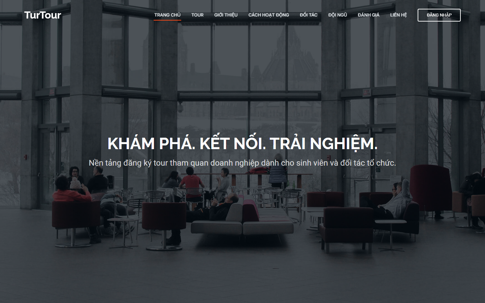

---

## 2. Đăng ký & đăng nhập

### 2.1 Đăng ký tài khoản

Có 3 hình thức đăng ký tùy vào mục đích sử dụng:

- **Khách / Sinh viên** – dùng để tìm và đăng ký tour.
- **Doanh nghiệp** – dùng nếu bạn là công ty muốn tổ chức tour (cần khai thêm hồ sơ công ty: tên, địa chỉ, ngành nghề, logo).
- **Tổ chức** – dùng nếu bạn tổ chức tour nhưng không phải công ty pháp nhân.

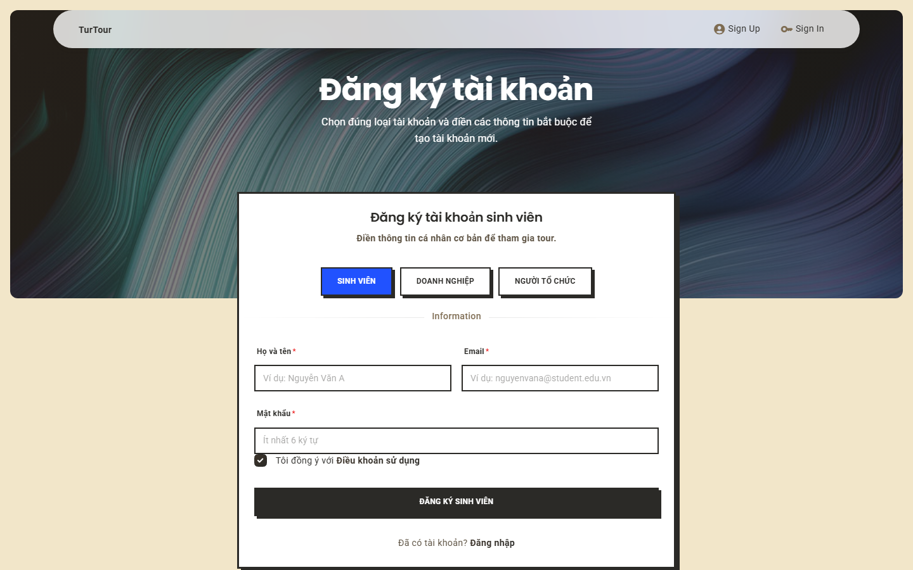

### 2.2 Xác thực email

Sau khi đăng ký, hệ thống gửi một email chứa liên kết xác thực. **Bạn phải bấm vào liên kết này thì tài khoản mới đăng nhập được.**

- Liên kết có hiệu lực trong **24 giờ**.
- Nếu không thấy email (kể cả trong mục Spam) hoặc liên kết đã hết hạn, bấm **"Gửi lại email xác thực"** trên màn hình đăng nhập.

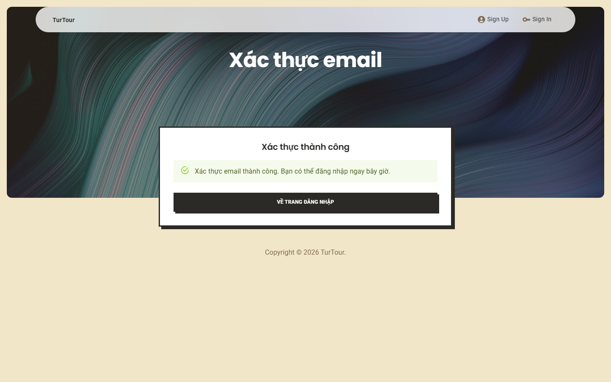

### 2.3 Đăng nhập

Nhập email và mật khẩu đã đăng ký. Hệ thống tự nhận diện vai trò và điều hướng đúng khu vực (trang công khai với Khách/Sinh viên, `/partner` với Doanh nghiệp/Tổ chức, `/admin` với Quản trị viên).

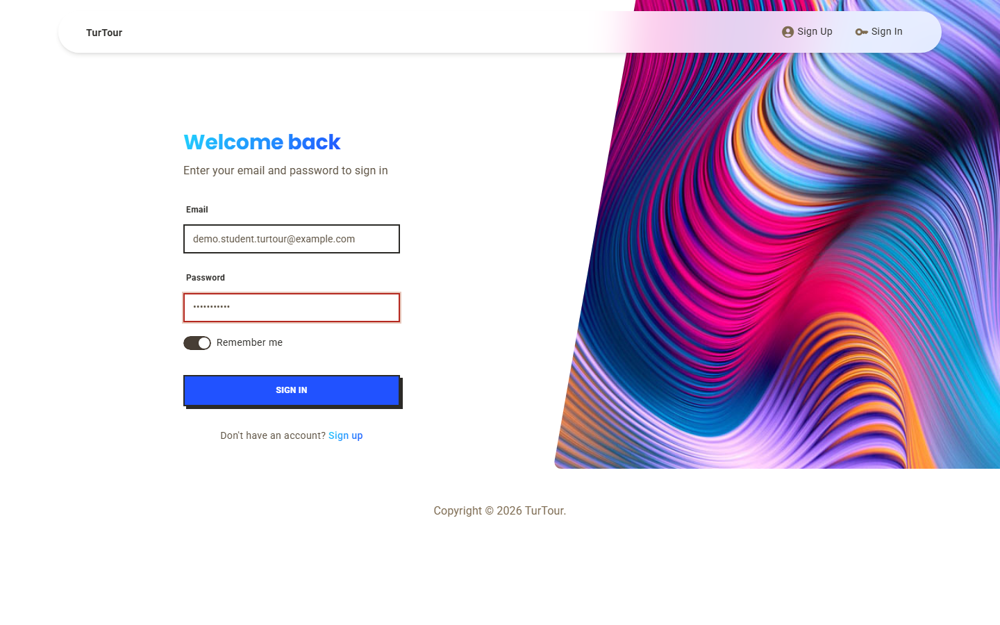

### 2.4 Hồ sơ cá nhân

Sau khi đăng nhập, vào mục **Hồ sơ** để cập nhật tên, số điện thoại, ảnh đại diện.

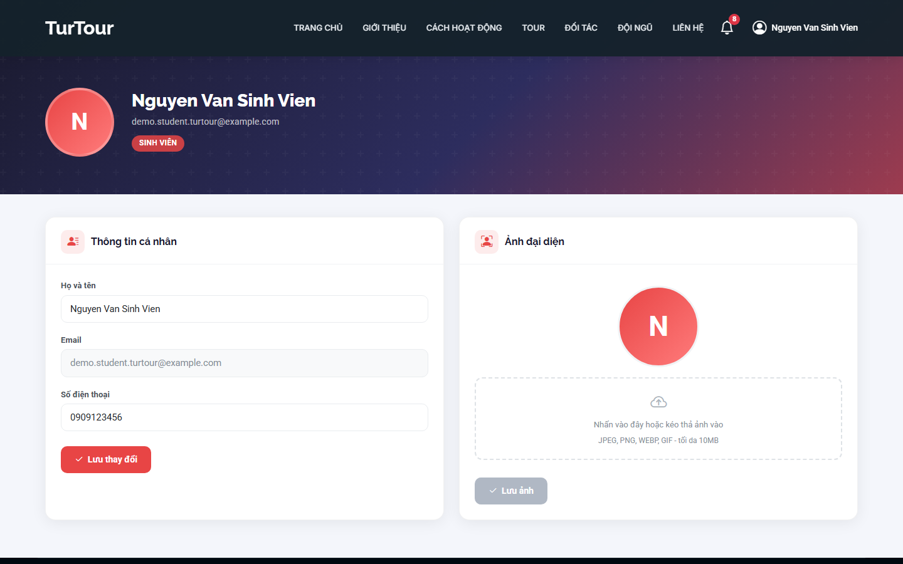

---

## 3. Dành cho Khách / Sinh viên

### 3.1 Tìm tour

Vào mục **Tour** trên trang chủ để xem danh sách tour đang mở. Có thể lọc/tìm theo từ khóa, địa điểm, khoảng giá...

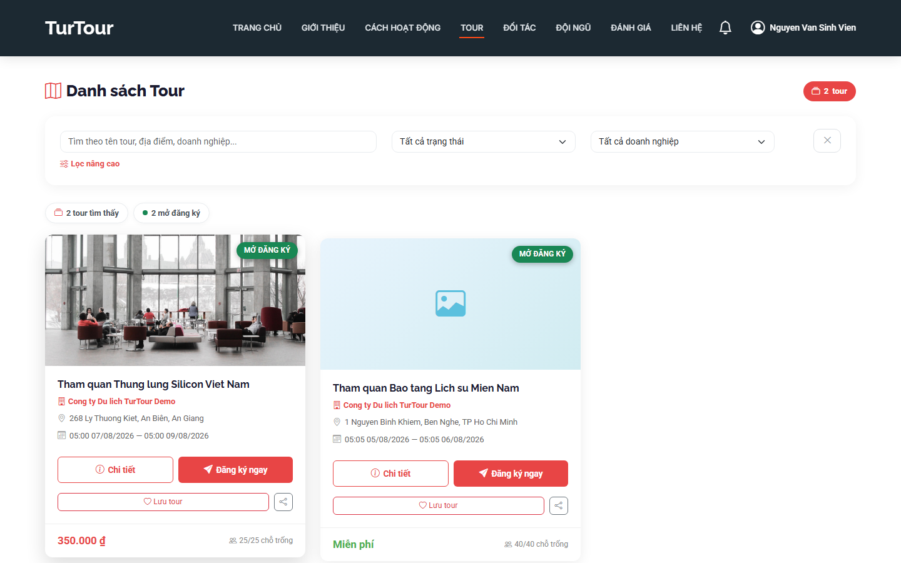

### 3.2 Xem chi tiết tour

Bấm vào một tour để xem đầy đủ: mô tả, lịch trình từng ngày, hình ảnh, giá, số chỗ còn lại, và đánh giá của người tham gia trước.

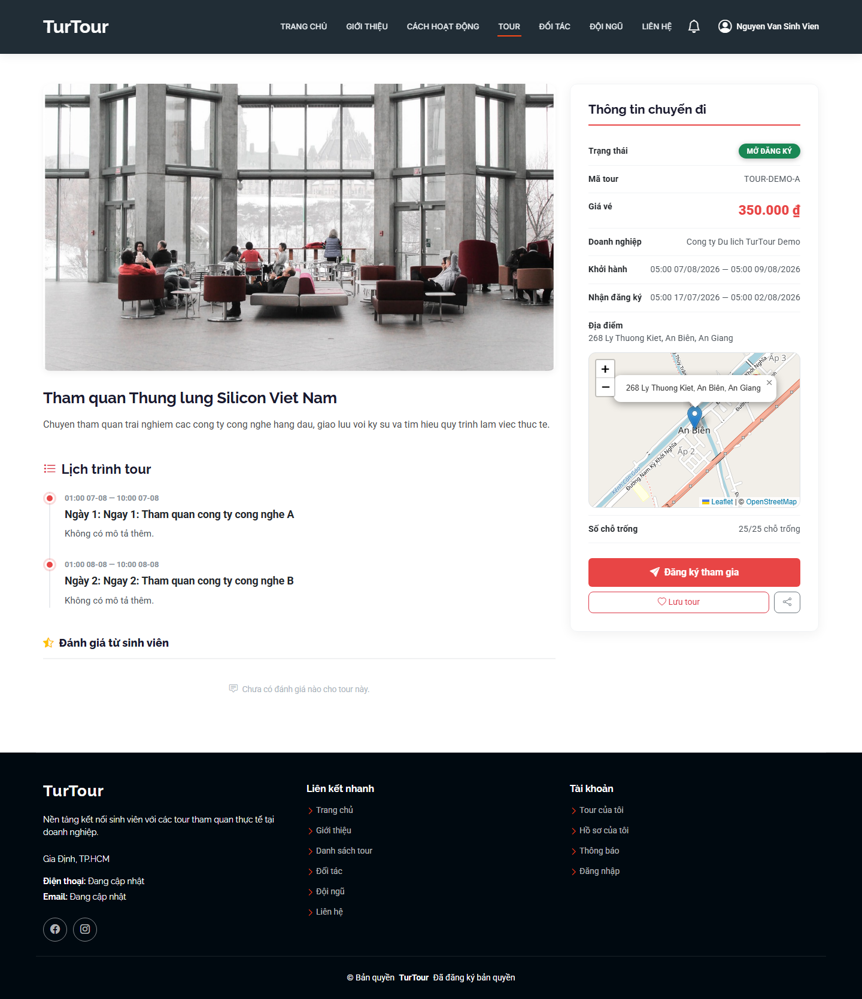

### 3.3 Lưu tour quan tâm

Bấm biểu tượng ❤ / "Lưu tour" để thêm vào danh sách quan tâm, xem lại sau tại mục **Tour đã lưu**.

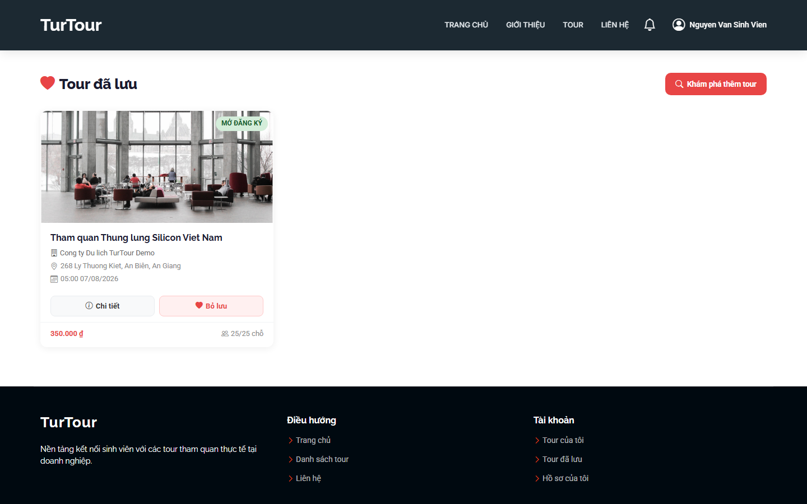

### 3.4 Đăng ký tour

Bấm nút **"Đăng ký"** trên trang chi tiết tour, có thể ghi chú thêm (VD: yêu cầu đặc biệt). Lưu ý:

- Chỉ đăng ký được khi tour còn trong **thời gian mở đăng ký**.
- Mỗi người chỉ đăng ký **1 lần/tour**.
- Nếu tour đã đủ chỗ, đăng ký sẽ tự động vào **danh sách chờ** — khi có người hủy, bạn sẽ được tự động đôn lên.

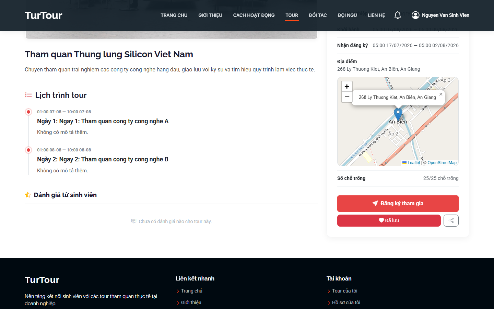

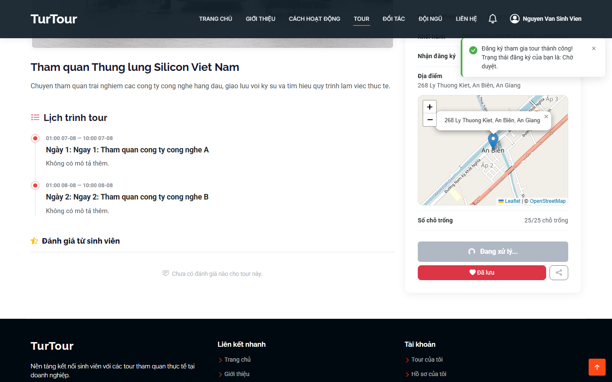

### 3.5 Theo dõi tour của tôi

Vào mục **Tour của tôi** để xem trạng thái từng đăng ký: *Chờ duyệt → Đã duyệt / Bị từ chối / Danh sách chờ → Đã thanh toán → Đã check-in → Hoàn thành*.

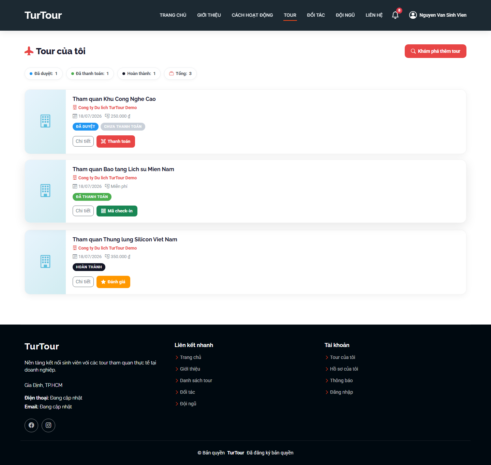

Có thể **hủy đăng ký** tại đây nếu chưa check-in/hoàn thành.

### 3.6 Thanh toán

Khi đăng ký được **duyệt** (và tour có phí), màn hình sẽ hiện:

- Nội dung chuyển khoản (đã điền sẵn).
- Mã **QR chuyển khoản ngân hàng** — chỉ cần mở app ngân hàng quét mã, mọi thông tin đã tự động khớp.
- Nút **"Báo đã chuyển khoản"** để nhắc đối tác kiểm tra (dùng khi thanh toán không tự khớp).

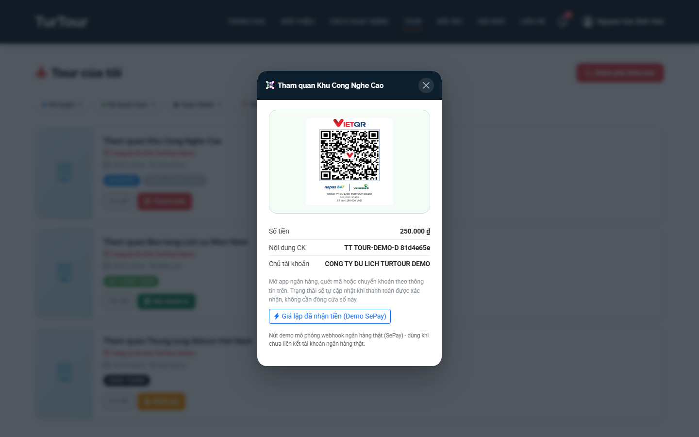

> Nếu là **tour miễn phí**, bạn không cần thanh toán — hệ thống tự chuyển sang "Đã thanh toán" ngay sau khi được duyệt.

Sau khi thanh toán được xác nhận, bạn sẽ nhận **email kèm mã QR check-in**.

### 3.7 Check-in tại điểm tập trung

Vào **Tour của tôi → Mã check-in** để xem mã QR của mình, xuất trình cho ban tổ chức quét khi tới điểm tập trung.

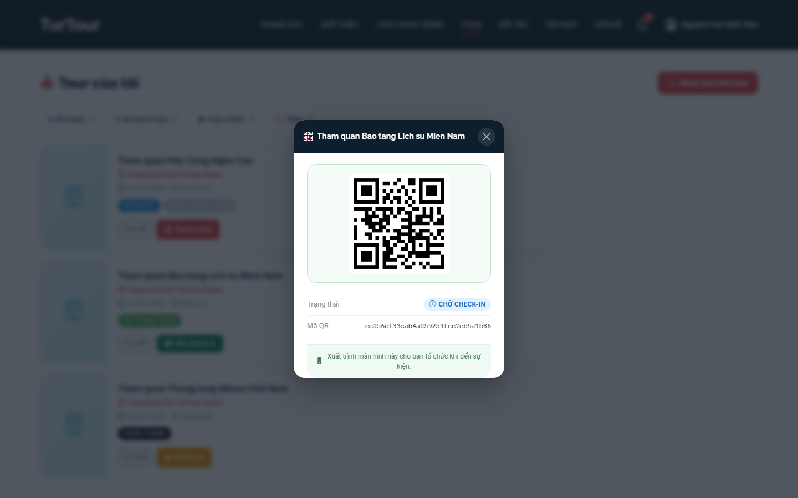

### 3.8 Đánh giá sau khi tham gia

Sau khi tour **kết thúc**, mục **Tour của tôi / Đánh giá của tôi** sẽ cho phép đánh giá: chọn số sao, viết nhận xét, đính kèm tối đa 4 ảnh. Mỗi tour chỉ đánh giá được **1 lần**.

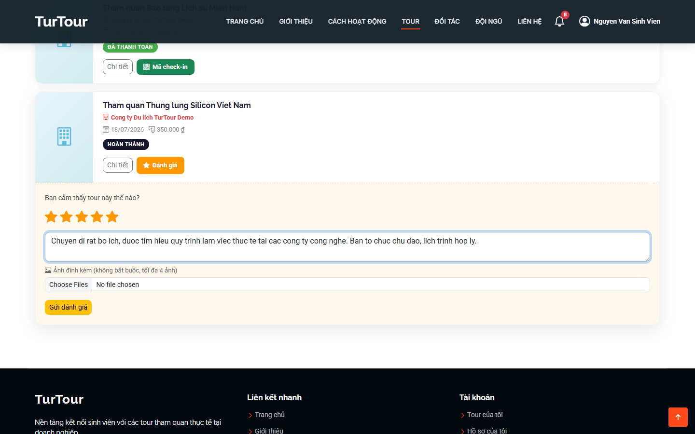

### 3.9 Thông báo

Biểu tượng chuông 🔔 hiển thị thông báo tức thời: đăng ký được duyệt, thanh toán được xác nhận, được đôn từ danh sách chờ...

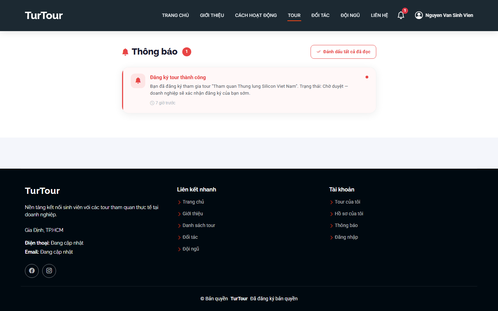

---

## 4. Dành cho Doanh nghiệp / Tổ chức (Đối tác)

### 4.1 Bảng điều khiển (Dashboard)

Sau khi đăng nhập, vào thẳng **Dashboard** để xem tổng quan: số tour, số đăng ký, doanh thu gần đây.

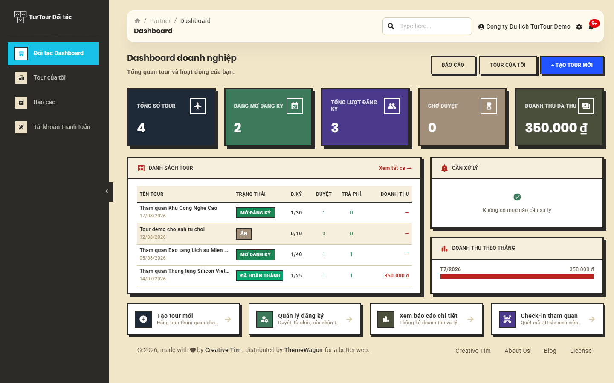

### 4.2 Tạo tour mới

Vào **Tour → Tạo tour**, điền đầy đủ thông tin:

| Mục | Ghi chú |
|---|---|
| Mã tour, Tiêu đề | Bắt buộc |
| Ảnh đại diện (Thumbnail) | Kéo-thả ảnh, có thể zoom/định vị trước khi lưu |
| Mô tả | Soạn thảo dạng rich text (chèn bảng, ảnh, định dạng chữ) |
| Địa điểm | Chọn tỉnh/thành → phường/xã, nhập địa chỉ chi tiết |
| Ngày bắt đầu / kết thúc | |
| Thời gian mở / đóng đăng ký | Phải trước ngày bắt đầu tour |
| Sức chứa, Chi phí | Để chi phí = 0 nếu là **tour miễn phí** |
| Yêu cầu tham gia | Không bắt buộc |

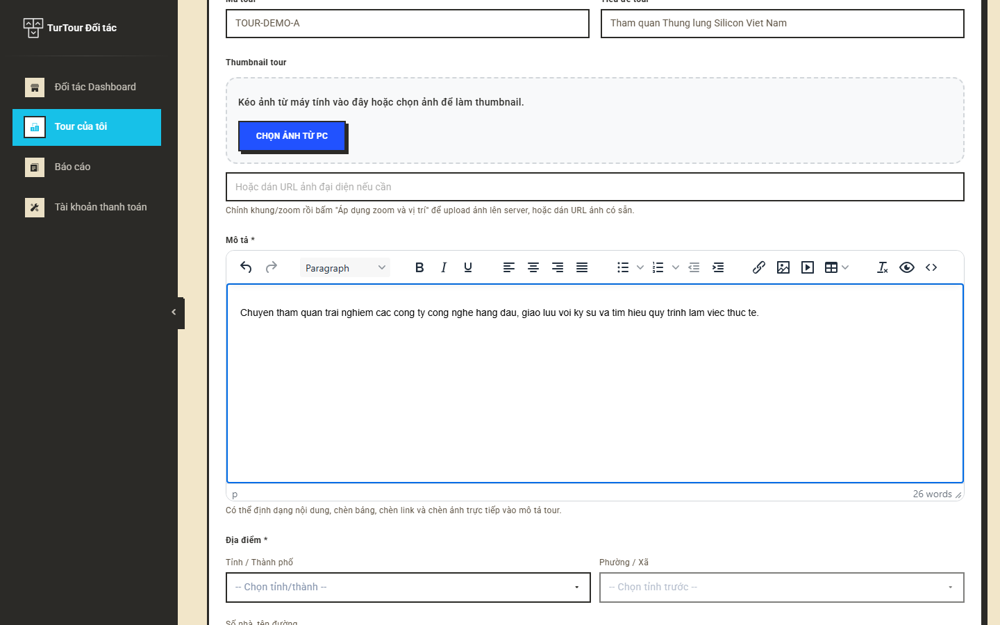

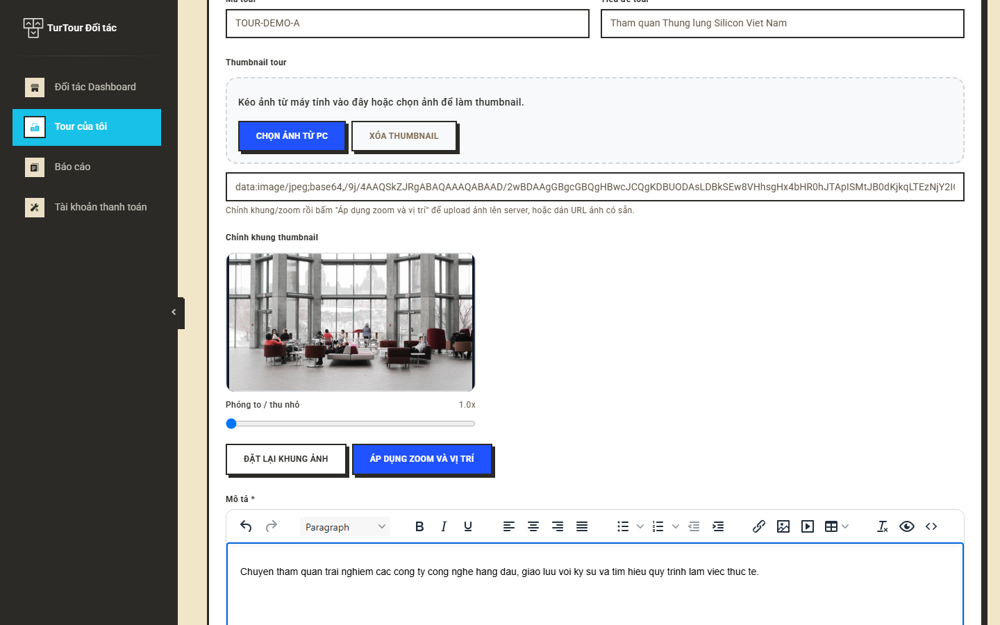

Thêm lịch trình chi tiết từng ngày bằng nút **"Thêm ngày"**:

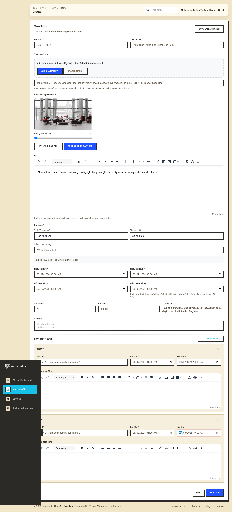

> **Lưu ý quan trọng:** Tour do Doanh nghiệp/Tổ chức tạo sẽ ở trạng thái **"Chờ duyệt"** và **chưa hiển thị công khai** cho tới khi Admin duyệt. Bạn sẽ nhận thông báo khi tour được duyệt hoặc bị từ chối (kèm lý do nếu bị từ chối).

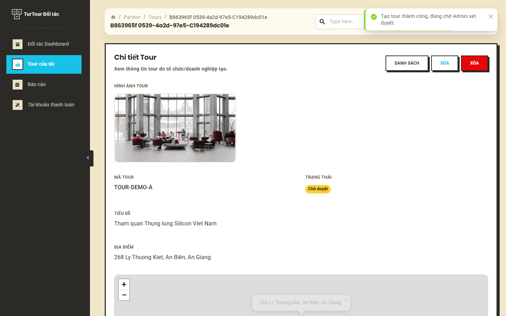

### 4.3 Quản lý tour của mình

Vào **Tour của tôi** để xem toàn bộ tour (đang chờ duyệt, bị từ chối, đang chạy...), sửa thông tin hoặc hủy tour khi cần.

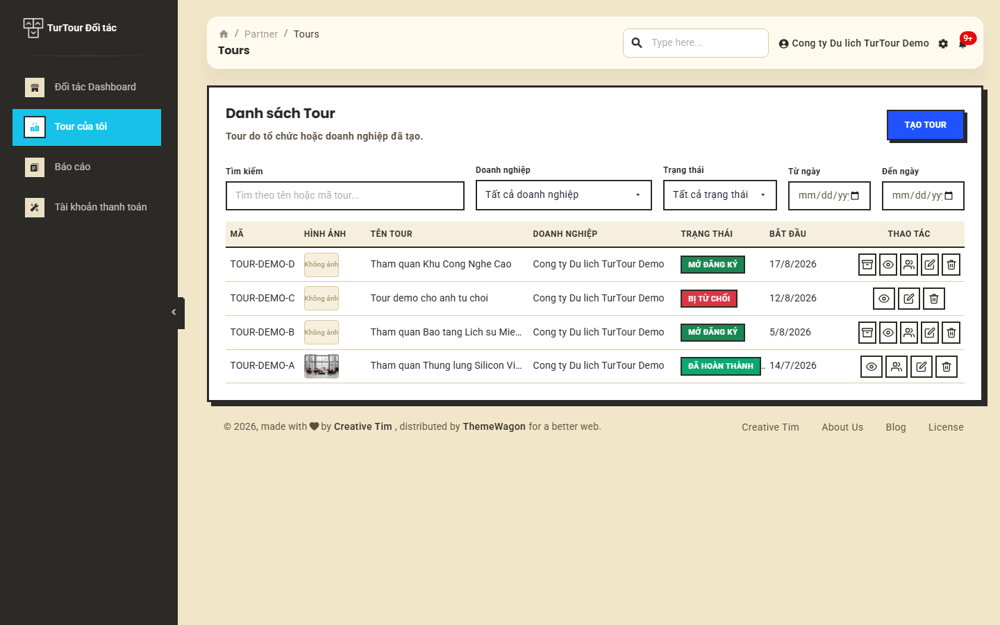

### 4.4 Quản lý danh sách đăng ký

Vào **Tour → chọn 1 tour → Đăng ký** để xem bảng danh sách người đăng ký, với các nút thao tác tùy trạng thái:

| Trạng thái đăng ký | Nút hiện ra |
|---|---|
| Chờ duyệt / Danh sách chờ | Duyệt, Từ chối |
| Đã duyệt (tour có phí) | Từ chối, Xác nhận thanh toán |
| Đã thanh toán | Tạo mã QR check-in |

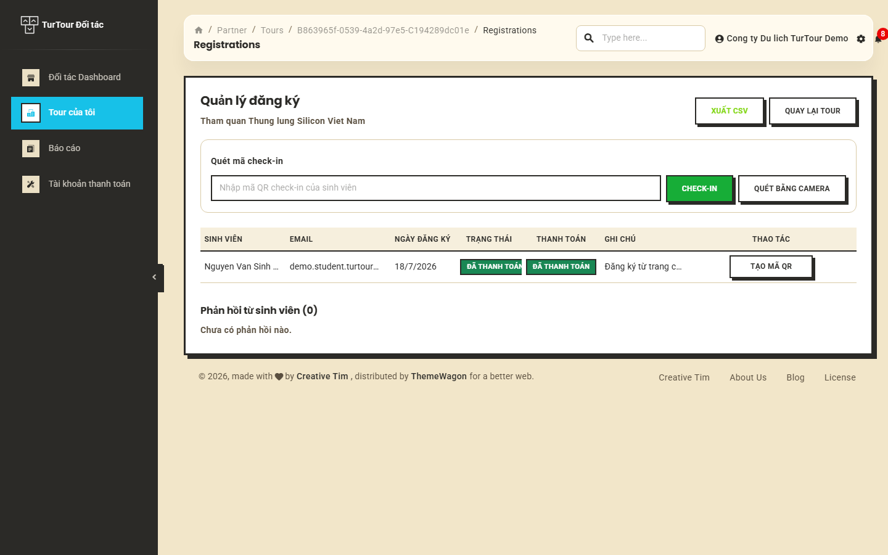

- **Duyệt**: mở hộp thoại xác nhận. Với tour miễn phí, hệ thống tự chuyển thẳng sang "Đã thanh toán".
- **Từ chối**: bắt buộc nhập lý do.
- **Xác nhận thanh toán**: nhập phương thức, mã giao dịch (tùy chọn), có thể tải lên ảnh chứng từ.

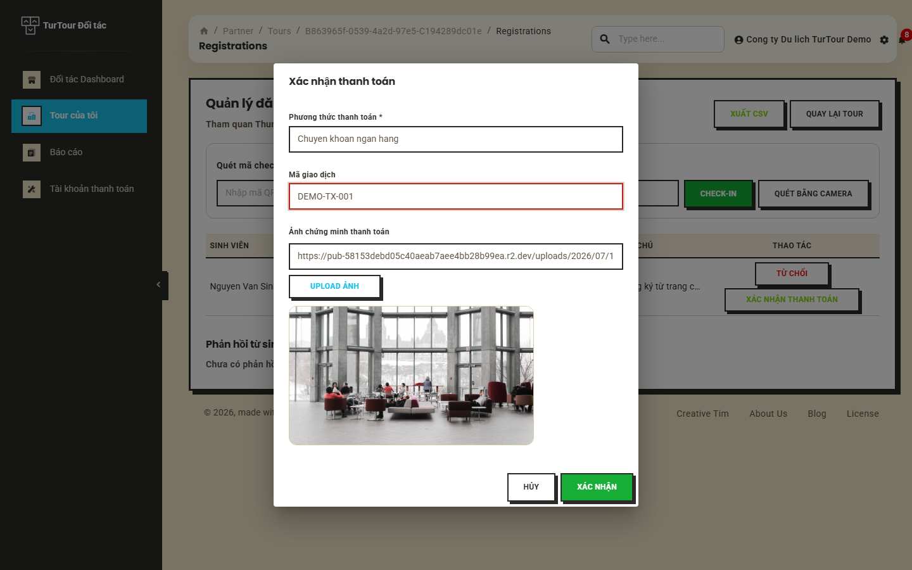

### 4.5 Quét mã check-in tại sự kiện

Trên trang quản lý đăng ký, có ô **"Quét bằng camera"** hoặc nhập tay mã QR để đánh dấu người tham gia đã check-in.

Ngoài ra có thể **xuất file CSV** danh sách đăng ký để lưu trữ/báo cáo.

### 4.6 Cài đặt tài khoản nhận thanh toán (chỉ Doanh nghiệp)

Vào **Cài đặt thanh toán**, chọn ngân hàng, nhập số tài khoản và tên chủ tài khoản. Hệ thống sẽ tự sinh mã QR chuyển khoản đúng cho từng đăng ký của khách.

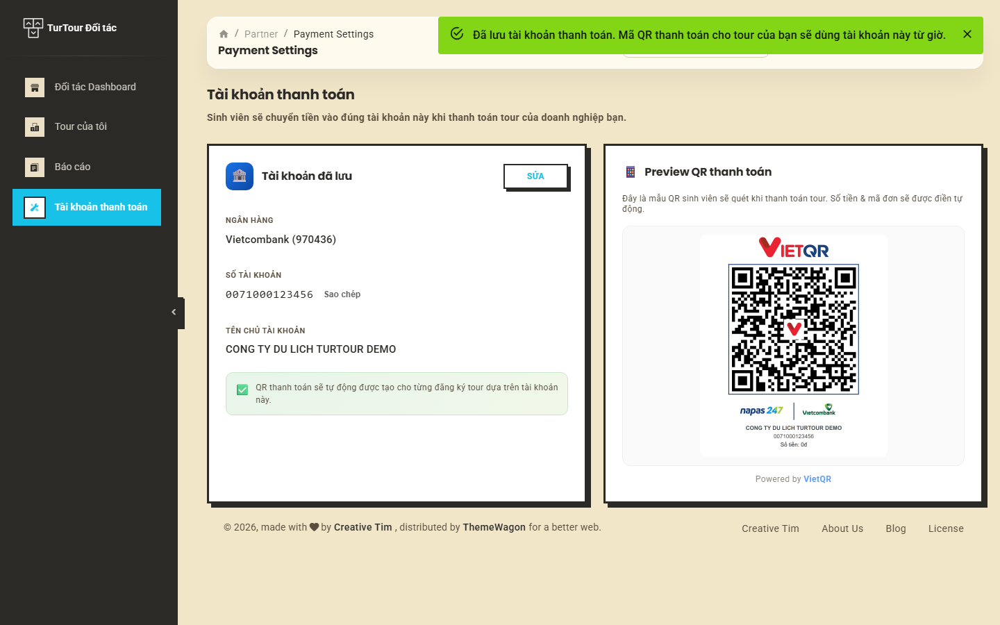

### 4.7 Báo cáo

Vào **Báo cáo** để xem doanh thu, số lượt đăng ký theo thời gian, giới hạn trong phạm vi tour của mình.

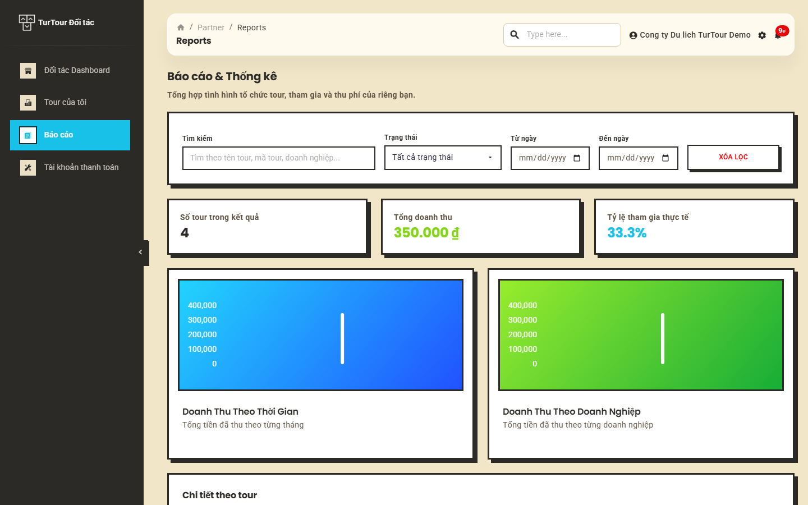

---

## 5. Dành cho Quản trị viên (Admin)

### 5.1 Bảng điều khiển tổng quan

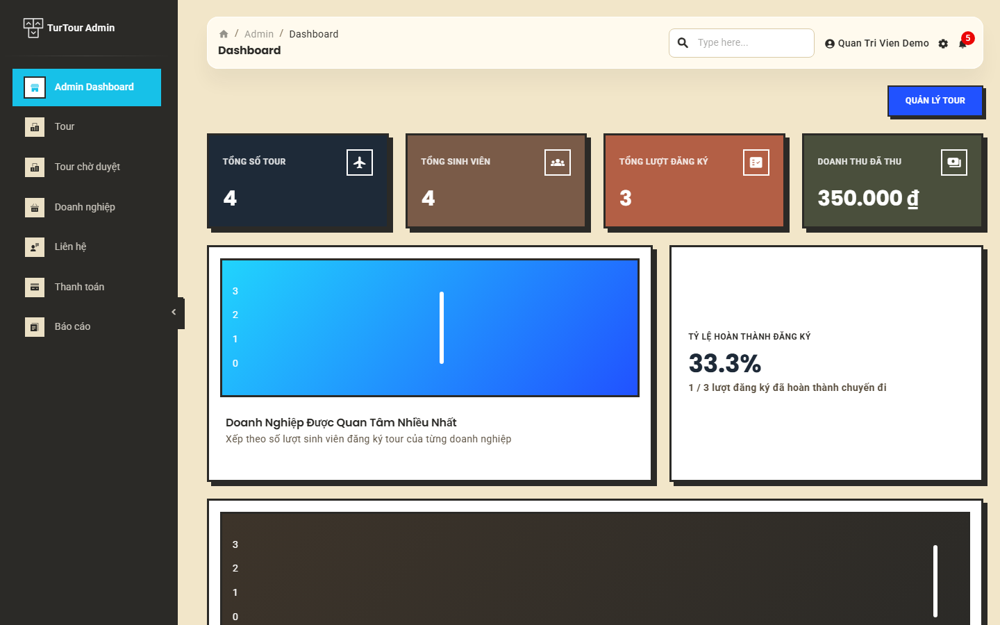

### 5.2 Duyệt tour

Vào **Tour → Chờ duyệt** để xem danh sách tour do Doanh nghiệp/Tổ chức gửi lên.

- **Duyệt**: tour chuyển sang hiển thị công khai (tự tính trạng thái hiển thị theo thời gian thực tế của tour).
- **Từ chối**: bắt buộc nhập lý do — đối tác sẽ thấy lý do này và có thể sửa lại để nộp lại.

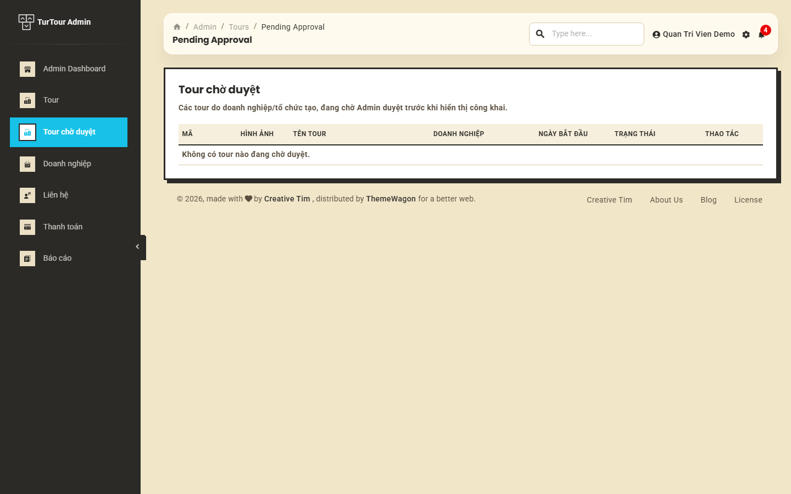

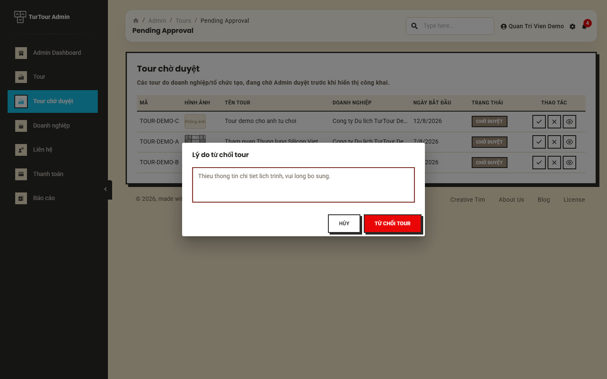

### 5.3 Quản lý tour toàn hệ thống

Xem toàn bộ tour ở mọi trạng thái, có thể hủy (archive) bất kỳ tour nào nếu cần.

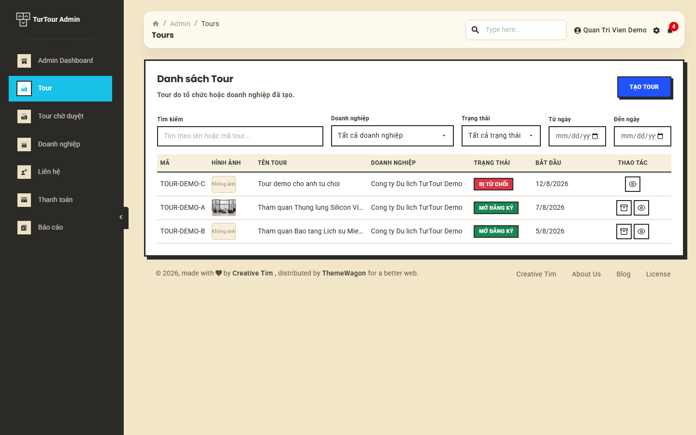

### 5.4 Quản lý doanh nghiệp

Xem/cập nhật/xóa hồ sơ doanh nghiệp. (Doanh nghiệp luôn tự đăng ký — Admin không có chức năng tạo mới doanh nghiệp.)

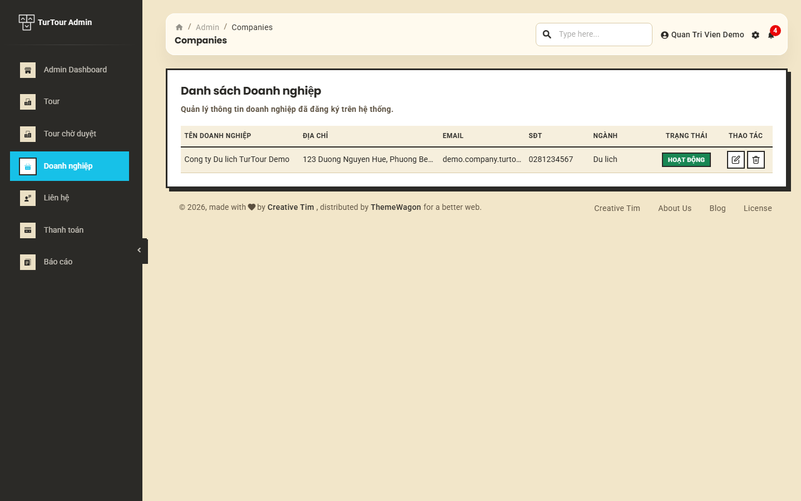

### 5.5 Quản lý thanh toán toàn hệ thống

Xem toàn bộ giao dịch (không giới hạn theo công ty), có thể tự xác nhận thanh toán thay đối tác. Có 2 thẻ tổng hợp: **Tổng doanh thu** và **Số giao dịch đã thanh toán**.

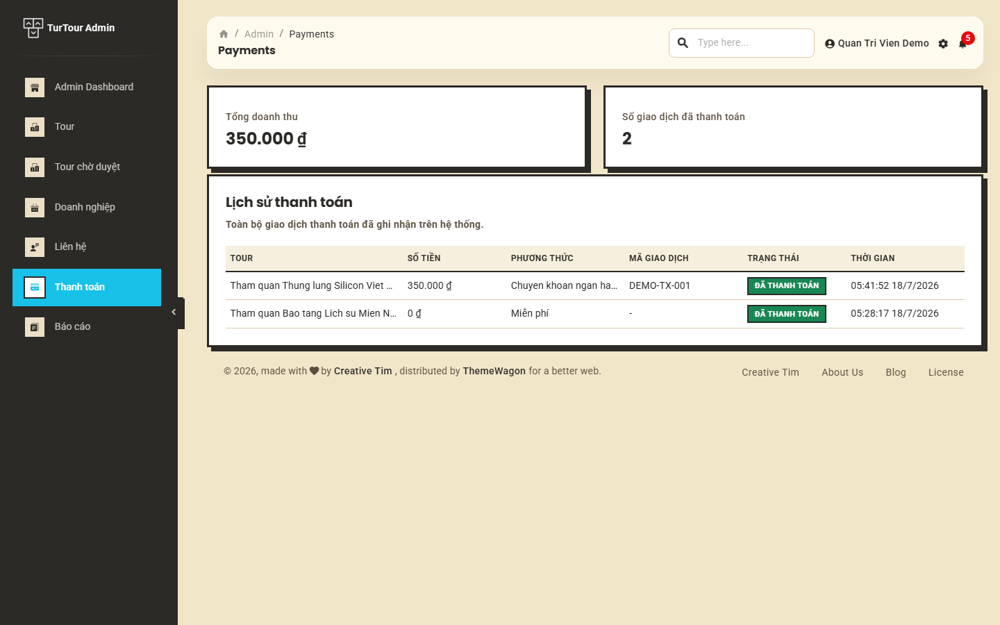

### 5.6 Xử lý liên hệ

Xem và xử lý các form liên hệ do khách gửi từ trang công khai.

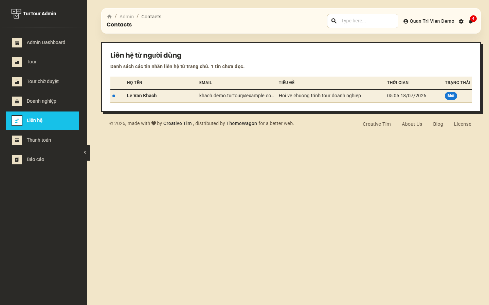

### 5.7 Báo cáo toàn hệ thống

Tổng hợp doanh thu, số tour, số đăng ký trên toàn nền tảng.

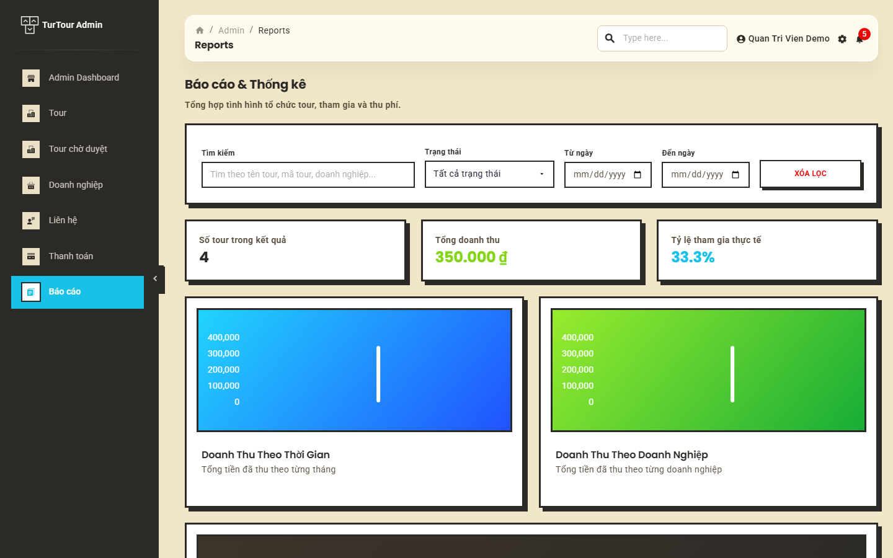

---

## 6. Câu hỏi thường gặp

**Tôi đăng ký xong nhưng không đăng nhập được?**
Kiểm tra email (kể cả mục Spam) để xác thực tài khoản trước. Nếu hết hạn liên kết, bấm "Gửi lại email xác thực" ở màn hình đăng nhập.

**Tôi đã chuyển khoản nhưng trạng thái vẫn chưa đổi thành "Đã thanh toán"?**
Bấm nút **"Báo đã chuyển khoản"** trên trang Tour của tôi để nhắc đối tác kiểm tra và xác nhận thủ công.

**Tour đã đủ chỗ, tôi có đăng ký được không?**
Có — bạn sẽ được xếp vào **danh sách chờ**, và tự động được duyệt khi có người hủy đăng ký.

**Tôi tạo tour xong nhưng không thấy hiển thị công khai?**
Tour do Doanh nghiệp/Tổ chức tạo cần **Admin duyệt** trước khi hiển thị công khai. Theo dõi thông báo để biết kết quả duyệt.

**Vì sao tôi chưa đánh giá được tour dù đã tham gia?**
Chỉ đánh giá được sau khi tour đã **chính thức kết thúc** theo lịch (hệ thống tự cập nhật, không phải ngay khi check-in).
